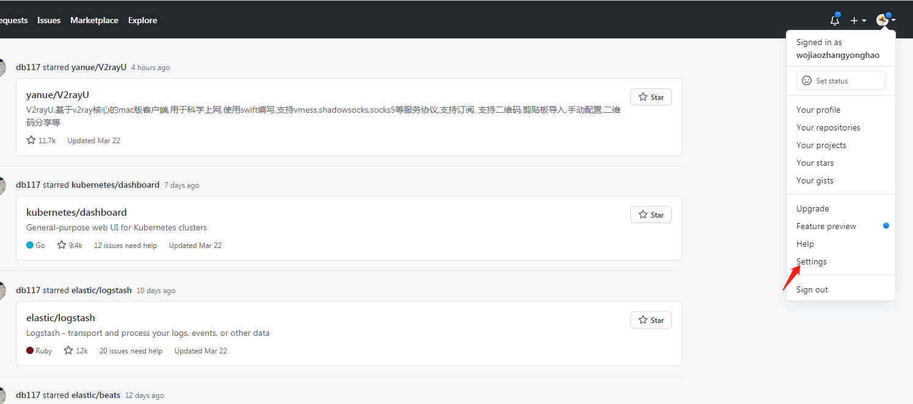
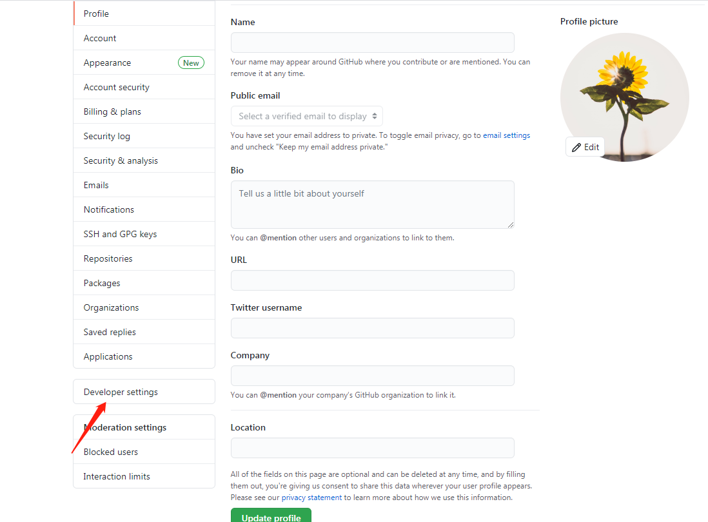
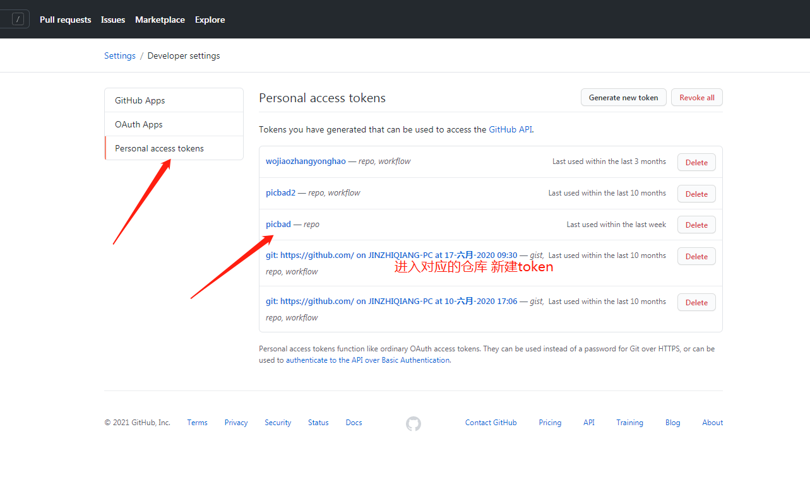
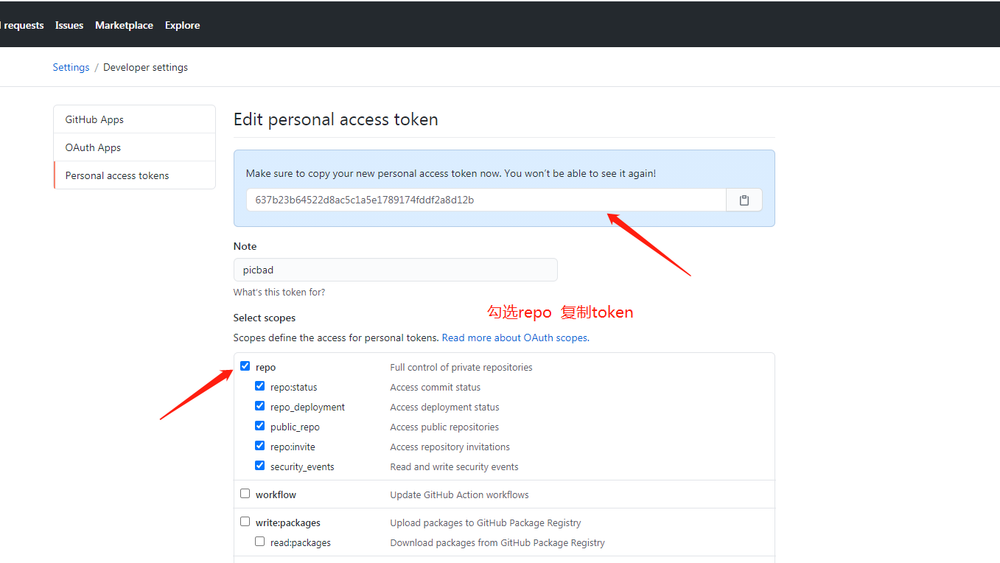
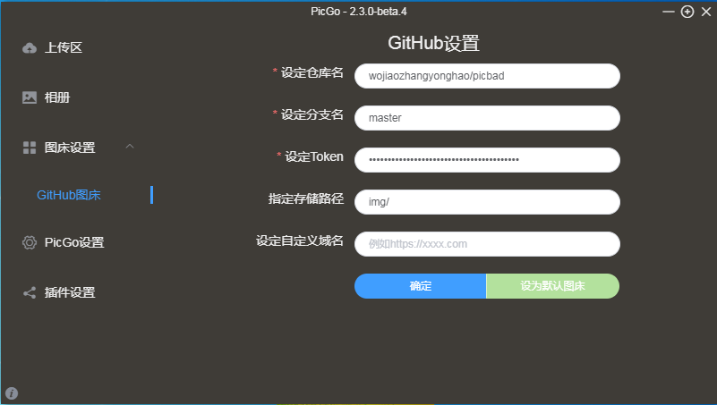

<!--
 * @Author: zyh
 * @Date: 2021-03-22 13:56:09
 * @LastEditors: zyh
 * @LastEditTime: 2021-04-25 16:04:45
 * @Description: file content
-->
- picGo 提取码：cywp [下载]链接: https://pan.baidu.com/s/10rCiVBihHMKPgG8kNnC3Hw 
# 如何使用？
1. github 创建私有创库

2. 如图生成token

3. 配置githun 铺床

设定仓库名按照“账户名/仓库名的格式填写”，比如我的是：wojiaozhangyonghao/img。

分支名统一填写“master”。

设定Token将之前的Token粘贴在这里。

指定存储路径 img/。

自定义域名cdn加速
https://cdn.jsdelivr.net/gh/GitHub用户名/仓库名
