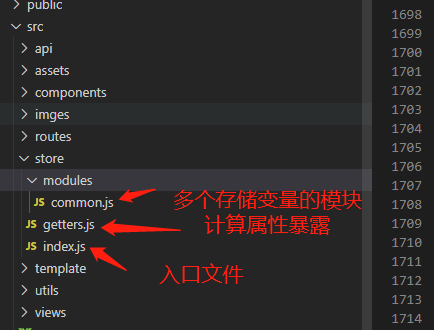

<!--
 * @Author: zyh
 * @Date: 2021-03-22 10:48:39
 * @LastEditors: zyh
 * @LastEditTime: 2021-04-28 09:46:45
 * @Description: file content
-->
# vue中store模块化封装
>vue 项目中公共变量的存储与使用，多人开发的时候需要区分,结构如图

入口
```javascript
// index.html
import Vue from 'vue'
import Vuex from 'vuex'
import common from './modules/common'
import getters from './getters'
Vue.use(Vuex)
const store = new Vuex.Store({
  modules: {
    common,
  },
  getters,
})

export default store

```
计算属性暴露
```javascript
//getter.js
const getters = {
  routerParams: state => state.common.routerParams,
}
export default getters
```
emmit事件封装
```javascript
// common.js
import {
    setStore,
    getStore,
} from '@/utils/store'
const common = {
    state: {
      routerParams:getStore({name:'routerParams'})||{},
      systemName:getStore({name:'systemName'})||'',
    },
    actions: {
    },
    mutations: {
      SET_ROUTER_PARAMS: (state, params) =>{
        state.routerParams = params
        setStore({
          name: 'routerParams',
          content: state.routerParams,
        })
      },
      SET_SYSTEM_NAME: (state, params) =>{
        state.systemName = params
        setStore({
          name: 'systemName',
          content: state.systemName,
          type: 'session'
        })
      },
    }
}
export default common
```
vuex数据存进session 防止刷新丢失
```javascript
import {
    validatenull
} from '@/utils/utils';
/**
 * 存储localStorage
 */
/* eslint-disable */
export const setStore = (params) => {
  let {
    name,
    content,
    type,
    datetime
  } = params;
  let obj = {
    dataType: typeof(content),
    content: content,
    type: type,
    datetime: new Date().getTime()
  }
  if (type) window.sessionStorage.setItem(name, JSON.stringify(obj));
  else window.localStorage.setItem(name, JSON.stringify(obj));
}
    /**
     * 获取localStorage
     */

export const getStore =(params)=> {
        let {
            name,
            type,
            debug
        } = params;
        let obj = {},
            content;
        obj = window.localStorage.getItem(name);
        if (validatenull(obj)) obj = window.sessionStorage.getItem(name);
        if (validatenull(obj)) return;
        obj = JSON.parse(obj);
        if (debug) {
            return obj;
        }
        if (obj.dataType == 'string') {
            content = obj.content;
        } else if (obj.dataType == 'number') {
            content = Number(obj.content);
        } else if (obj.dataType == 'boolean') {
            content = eval(obj.content);
        } else if (obj.dataType == 'object') {
            content = obj.content;
        }
        return content;
    }
    /**
     * 删除localStorage
     */
export const removeStore = params => {
    let {
        name
    } = params;
    window.localStorage.removeItem(name);
    window.sessionStorage.removeItem(name);
}

/**
 * 获取全部localStorage
 */
export const getAllStore = (params) => {
    let list = [];
    let {
        type
    } = params;
    for (let i = 1; i <= window.sessionStorage.length; i++) {
        if (type) {
            list.push({
                name: window.sessionStorage.key(i),
                content: getStore({
                    name: window.sessionStorage.key(i),
                    type: 'session'
                })
            })
        } else {
            list.push(getStore({
                name: window.localStorage.key(i),
                content: getStore({
                    name: window.localStorage.key(i),
                })
            }))
        }
    }

    return list;

}

/**
 * 清空全部localStorage
 */
export const clearStore = (params) => {
    let {
        type
    } = params;
    if (type) {
        window.sessionStorage.clear();
        return
    }
    window.localStorage.clear()
}
```
validatenull方法 判断是否为空
```javascript
/**
 * 判断是否为空
 */
/* eslint-disable */
export function validatenull(val) {
  if (typeof val == 'boolean') {
      return false;
  }
  if (typeof val == 'number') {
      return false;
  }
  if (val instanceof Array) {
      if (val.length == 0) return true;
  } else if (val instanceof Object) {
      if (JSON.stringify(val) === '{}') return true;
  } else {
      if (val == 'null' || val == null || val == 'undefined' || val == undefined || val == '') return true;
      return false;
  }
  return false;
};
```
